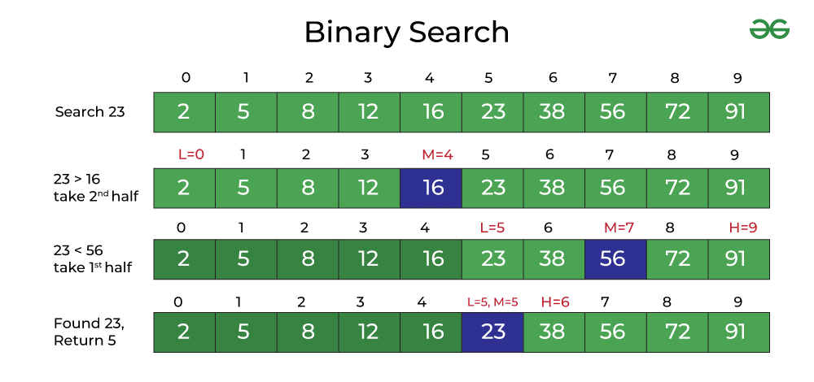

# <span style="color: white;">Linear Search Algorithm</span>

In Linear Search or Sequential Search, every element in the array is checked, and if the match is found then the element index is returned otherwise, the search continues till the last element.

```js
function linearSearch(array, target) {
    for (let i = 0; i < array.length; i++) {
        if (array[i] == target) {
            return i
        } else {
        }
    }
    return - 1
}

console.log(linearSearch([1, 2, 3, 4, 5, 6], 6)); // 5
console.log(linearSearch([1, 2, 3, 4, 5, 6], 2)); // 1
console.log(linearSearch([1, 2, 3, 4, 5, 6], 8)); // -1
```

+ Disadvantages: 
    - Slow for large data sets.
+ Advantages:
    - Fast for searches of small to medium data sets
    - Does not need to sorted
    - Useful for data structures that do not have random access (Linked list)

### Time Complixity of linear search

+ **Best-Case**
    + If our target value is at the beginning of the array, the algorithm will always run at constant time, <u>O(1)</u>. The algorithm will always only have to perform one comparison, no matter what the size of the array.

+ **Worst-Case**
    + If our target is the last element in the array, then the algorithm will have to make n comparisons (n being the length of the input array). This means that the Big O notation of Linear Search is Big <u>O(n)</u> – linear time complexity.

+ **Average-Case**
    + If our target element is somewhere in the middle of the array, then the time complexity will be approximately <u>O(n/2)</u>, which simplifies to O(n) – linear time.

<br>
<br>

# <span style="color: white;">Binary Search Algorithm</span>

Binary Search is a searching technique which works on the Divide and Conquer approach. It is used to search for any element in a sorted array. 
Compared with linear, binary search is much faster with a Time Complexity of O(logN), whereas linear search works in O(N) time complexity.



### Binary Search Pseudocode

*if the array is empty, return -1, as the element cannot be found*

*if the array has elements. find the middle element in the array. if target is equale to the middle element, return the middle element index*

*if target is less than the middle element, binary search left half of the array*

*if the target is greater than the middle element, binary search right half of the array*

### Implementation

```js
function binarySearche(array, target) {
    let low = 0;
    let high = array.length - 1;

    while (low <= high) {
        let middleIndex = Math.floor((low + high) / 2);
        if (array[middleIndex] == target) {
            return middleIndex
        } else if (array[middleIndex] < target) {
            low = middleIndex + 1;
        } else {
            high = middleIndex - 1;
        }
    }
    return -1
}

let array = [-5, 2, 6, 10, 20, 30];
console.log(binarySearche(array, -5)); // 0
console.log(binarySearche(array, 30)); // 5
console.log(binarySearche(array, 6)); // 2
```

### Recursive Binary search

```js
function recursivBinarySearch(arr, target) {
    return search(arr, target, 0, arr.length - 1)
}

function search(arr, target, leftIndex, rightIndex) {
    if (leftIndex > rightIndex) {
        return -1
    }

    let middleIndex = Math.floor((leftIndex + rightIndex) / 2);

    if (target == arr[middleIndex]) {
        return middleIndex
    }

    if (target < arr[middleIndex]) {
        return search(arr, target, leftIndex, middleIndex - 1)
    } else {
        return search(arr, target, middleIndex + 1, rightIndex)
    }
}

let array = [-5, 2, 6, 10, 20, 30];
console.log(recursivBinarySearch(array, -5)); // 0
console.log(recursivBinarySearch(array, 30)); // 5
console.log(recursivBinarySearch(array, 6)); // 2
```