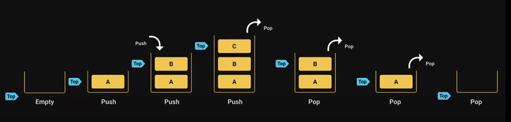

<style>h1,h2,h3,h4 { border-bottom: 0; } </style>
# <span style="color: white;">Stack Data Structure</span>

## Introduction

The stack data structure is a sequential collection of elements that follows the principle of <span style="color: coral">Last In First Out (LIFO)</span>.

The last element inserted into the stack is first element to be removed.

Stack is abstract data type. it is defined by its behavior rather than being a mathimatical model.

The stack data structure supports two main operations:

+ **Push**: which add an element to the collection.
+ **Pop** : which removes the most recently added element from the collection.

## Visualazation - Push & Pop



## Stack Usage

+ Browser history tracking
+ Undo Operation when typing
+ Expression conversion
+ Call Stack in javascript

## Stack Implementation

```js
class Stack {
    constructor() {
        this.items = [];
    }
    push(element) {
        this.items.push(element)
    }
    pop() {
        return this.items.pop()
    }
    peek() {
        return this.items[this.items.length - 1]
    }
    isEmpty() {
        return this.items.length == 0
    }
    size() {
        return this.items.length
    }
    print() {
        return this.items.join(", ")
    }
}
```

### Test

```js
let stack = new Stack();
stack.push(10)
stack.push(20)
stack.push(30)
stack.push(40)
stack.push(50)
console.log(stack); // Stack {items: [10, 20, 30, 40, 50]}
console.log(stack.size()); // 5
console.log(stack.print()); // 10, 20, 30, 40, 50
console.log(stack.pop()); // 50
console.log(stack.peek()); // 40
```

**Properties Explanation**

+ **push(element)** - add an element to the to of the stack
+ **pop()** - remove the top most element from the stack and return it
+ **peek()** - get the value of the top element without removing it
+ **isEmpty()** - check if the stack is empty
+ **size()** - get the number of elements in the stack
+ **print()** - visualize the elements in the stack