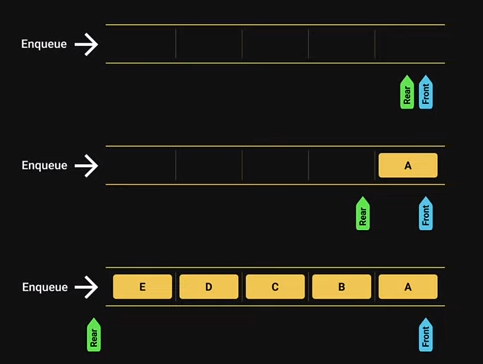

<style>h1,h2,h3,h4 { border-bottom: 0; } </style>
# <span style="color: white;">Queue Data Structure</span>

## Introduction

The Queue data structure is a sequantial collection of elements that follows the principle of <span style="color: coral">First In Firt Out (FIFO)</span>.

The first element inserted into the queue is first element to be removed.

**Analogy (a queu of people):** People enter the queue at one end **(rear/tail)**, and leave the queue from the other end **(front/head)**.

Queue is an abstract data type. it is defined by its behavior rather than being a mathematical model.

The queue supports two main operations:

+ **Enqueue:** which adds an element to the rear/tail of the collection
+ **Dequeue:** which removes an element from the front/head of the collection

## Visualazation

<figure style="display: flex; gap: 10px;">
    
    
</figure>

## Queue Usage
+ Printers
+ CPU task scheduling
+ Callback queue in javascript runtime

## Implementation

```js
class Queue {
    constructor() {
        this.queue = [];
    }
    enqueue(element) {
        this.queue.push(element);
    }
    dequeue() {
        return this.queue.shift();
    }
    peek() {
        if (this.isEmpty()) {
            return null
        }
        return this.queue[0];
    }
    isEmpty() {
        return this.queue.length == 0;
    }
    size() {
        return this.queue.length
    }
    print() {
        return this.queue.join(", ")
    }
}
```

### Testing

```js
let queue = new Queue();

queue.enqueue(10)
queue.enqueue(20)
queue.enqueue(30)
queue.enqueue(40)
queue.enqueue(50)

console.log(queue.print()) // 10, 20, 30, 40, 50
console.log(queue.dequeue()) // 10
console.log(queue.print()) // 20, 30, 40, 50

console.log(queue.isEmpty()) // false
console.log(queue.size()) // 4
console.log(queue.peek()) // 20
```