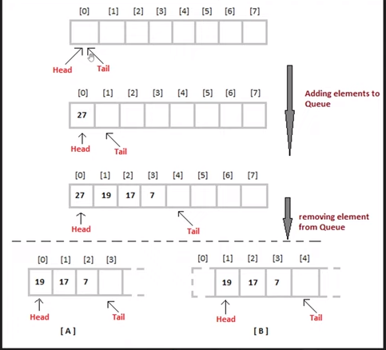

<style>h1,h2,h3,h4 { border-bottom: 0; } </style>
# <span style="color: white;">Queue Data Structure</span>

## Introduction

The Queue data structure is a sequantial collection of elements that follows the principle of <span style="color: coral">First In Firt Out (FIFO)</span>.

The first element inserted into the queue is first element to be removed.

**Analogy (a queu of people):** People enter the queue at one end **(rear/tail)**, and leave the queue from the other end **(front/head)**.

Queue is an abstract data type. it is defined by its behavior rather than being a mathematical model.

The queue supports two main operations:

+ **Enqueue:** which adds an element to the rear/tail of the collection
+ **Dequeue:** which removes an element from the front/head of the collection

## Visualazation

<figure style="display: flex; gap: 10px;">
    
    
</figure>

## Queue Usage
+ Printers
+ CPU task scheduling
+ Callback queue in javascript runtime

## Implementation

```js
class Queue {
    constructor() {
        this.queue = [];
    }
    enqueue(element) {
        this.queue.push(element);
    }
    dequeue() {
        return this.queue.shift();
    }
    peek() {
        if (this.isEmpty()) {
            return null
        }
        return this.queue[0];
    }
    isEmpty() {
        return this.queue.length == 0;
    }
    size() {
        return this.queue.length
    }
    print() {
        return this.queue.join(", ")
    }
}
```

### Testing

```js
let queue = new Queue();

queue.enqueue(10)
queue.enqueue(20)
queue.enqueue(30)
queue.enqueue(40)
queue.enqueue(50)

console.log(queue.print()) // 10, 20, 30, 40, 50
console.log(queue.dequeue()) // 10
console.log(queue.print()) // 20, 30, 40, 50

console.log(queue.isEmpty()) // false
console.log(queue.size()) // 4
console.log(queue.peek()) // 20
```

## Implementation - Optimised

in the previous implementation above, we have "dequeue" has O(n) time complixity. but in this optimised solution we'll make it constant O(1) time complixity

### Visualazation



```js
/*
    دبا عندنا هاد الطابور غنطبقو ال behavior ديالو فال array

    اول حاجة كنديرو جوج pointers اي مؤشر, اللول كيشير على ال head ديال الطابور والثاني على الذيل ديالو
    على شكل متغيرين القيمة ديالهم بجوج 0

    بالنسبة لل enqueue
    فاش كدير enqueue كتحطو فال items object, ال key بقيمة ال tail الحالية
    من بعد كتزيد 1 على القيمة السابقة لل tail
    باش ملي دير enqueue اخر ميديرش override على القديم

    اما بالنسبة لل dequeue
    ف فلول كيكون قيمتو هي 0 
    اول حاجة كدير متغير كتحفض فيه العنصر اللول باش تحذفو فالخطوة الجاية
    كتحذف العنصر باستعمال delete keyword
    من بعد كتزيد 1 على قيمة head pointer باش يشير على العنصر الموالي ميبقاش غا فنفس القيمة اللولة
    من بعد كترجع داك المتغير لي حفضتي فيه الداتا قبل متمسحها

    بالنسبة لل size
    فراه كيتحسب ب مجموع طرع قيمة ال tail pointer من قيمة ال head pointer

    اما ال isEmpty فراه باينة, كترجع boolean على حسب الشرط ديال واش ال size == 0


    لمهم لدختي حاول تربط هادشي بالصورة الفوق مع الكود لتحت
*/
```

```js
class Queue {
    constructor() {
        this.items = {};
        this.head = 0;
        this.tail = 0;
    }

    enqueue(element) {
        this.items[this.tail] = element;
        this.tail++
    }

    dequeue() {
        if (this.isEmpty()) return;
        let item = this.items[this.head];
        delete this.items[this.head];
        this.head++
        return item
    }

    size() {
        return this.tail - this.head
    }

    isEmpty() {
        return this.size() == 0
    }

    peek() {
        return this.items[this.head]
    }
}
```

```js
let queue = new Queue();
queue.enqueue("a")
queue.enqueue("b")
queue.enqueue("c")
queue.enqueue("d")
console.log(queue); // Queue {items: {…}, head: 0, tail: 4}

console.log(queue.size()); // 4
console.log(queue.dequeue()); // a
console.log(queue.dequeue()); // b
console.log(queue.dequeue()); // c

console.log(queue); // Queue {items: {…}, head: 3, tail: 4}
```