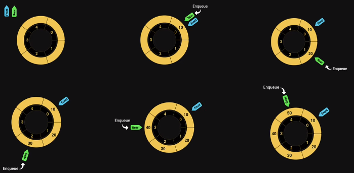
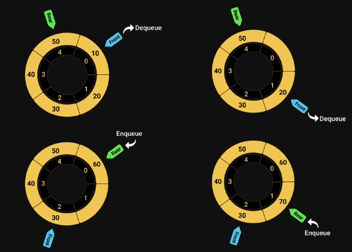

<style>h1,h2,h3,h4 { border-bottom: 0; } </style>
# <span style="color: white;">Circular Queue Data Structure</span>

## Introduction

A Circular Queue is an extended version of a normal queue where the last element of the queue is connected to the first element of the queue forming a circle.

The operations are performed based on <span style="color: coral">FIFO (First In First Out)</span> principle. It is also called <span style="color: coral">‘Ring Buffer’</span>. 

## Visualazation




## Time Complexity Analysis

Time Complexity: 
+ Enqueue: O(1) because no loop is involved for a single enqueue.
+ Dequeue: O(1) because no loop is involved for one dequeue operation.

Auxiliary Space: O(N) as the queue is of size N.

## Usage

+ **Memory Management**: The unused memory locations in the case of ordinary queues can be utilized in circular queues.
+ **Traffic system**: In computer controlled traffic system, circular queues are used to switch on the traffic lights one by one repeatedly as per the time set.
+ **CPU Scheduling**: Operating systems often maintain a queue of processes that are ready to execute or that are waiting for a particular event to occur.

## Implementation

```js
class CircularQueue {
    constructor(capacity) {
        this.items = new Array(capacity);
        this.rear = -1;
        this.front = -1;
        this.currentLength = 0;
        this.capacity = capacity;
    }

    isFull() {
        return this.currentLength === this.capacity;
    }

    isEmpty() {
        return this.currentLength === 0;
    }

    size() {
        return this.currentLength;
    }

    enqueue(item) {
        if (!this.isFull()) {
            this.rear = (this.rear + 1) % this.capacity;
            this.items[this.rear] = item;
            this.currentLength += 1;
            if (this.front === -1) {
                this.front = this.rear;
            }
        }
    }

    dequeue() {
        if (this.isEmpty()) {
            return null;
        }
        const item = this.items[this.front];
        this.items[this.front] = null;
        this.front = (this.front + 1) % this.capacity;
        this.currentLength -= 1;
        if (this.isEmpty()) {
            this.front = -1;
            this.rear = -1;
        }
        return item;
    }

    peek() {
        if (!this.isEmpty()) {
            return this.items[this.front];
        }
        return null;
    }

    print() {
        if (this.isEmpty()) {
            console.log("Queue is empty");
        } else {
            let i;
            let str = "";
            for (i = this.front; i !== this.rear; i = (i + 1) % this.capacity) {
                str += this.items[i] + " ";
            }
            str += this.items[i];
            console.log(str);
        }
    }
}
```