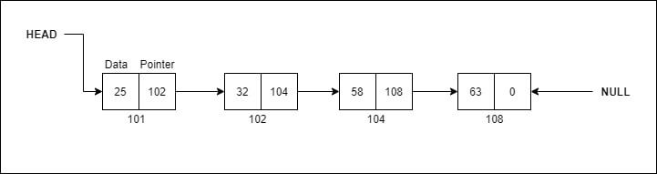
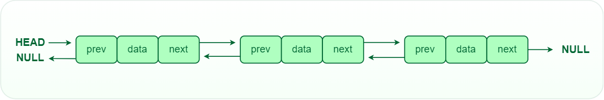

<style>h1,h2,h3,h4 { border-bottom: 0; } </style>
# <span style="color: white;">Linked List Data Structure</span>

# Introduction 

A linked list is a linear data structure, in which the elements are not stored at contiguous memory locations. The elements in a linked list are linked using pointers as shown in the below image:

<figure>
    
    
</figure>

In simple words, a linked list consists of nodes where each node contains a data field and a reference(link) to the next node in the list.

**<span style="color: coral">Node Structure</span>**: A node in a linked list typically consists of two components:
+ **Data**: It holds the actual value or data associated with the node
+ **Next Pointer**: It stores the memory address (reference) of the next node in the sequence.

**<span style="color: coral">Head and Tail</span>**: the linked list accessed through the head node, which points to the first node in the list. the last node in the list points to **null**, indicating the end of the list. this node is known as the tail node.

<br>
<br>

# Types of Linked List

<br>
<br>

There are mainly three types of linked list:

+ <span style="color: lightgreen">**Single-Linked list**<span>

in a single linked list, each node contains a reference to the next node in the sequence. Traversing a singly linked list is done in a forward direction.


+ <span style="color: lightgreen">**Doubly-Linked list**<span>

in a doubly linked list, each node contains reference to both the next and previous node. this allow for traversal in both forward and backward directions. but it requires additional memory for the backward reference.




+ <span style="color: lightgreen">**Circular-Linked list**<span>

 In a circular linked list, the last node points back to the head node, creating a circular structure. It can be either singly or doubly linked.


<br>
<br>

# Implementations

<br>
<br>

## Singly linked list

```js
class LinkedList_Node {
    constructor(value) {
        this.value = value;
        this.next = null;
    }
}

class LinkedList {
    constructor() {
        this.head = null;
        this.size = 0;
    }

    isEmpty() {
        return this.size == 0;
    }

    getSize() {
        return this.size
    }
    // O(1)
    prepend(value) {
        const newNode = new LinkedList_Node(value);
        if (this.isEmpty()) {
            this.head = newNode;
            this.size++
        } else {
            newNode.next = this.head;
            this.head = newNode;
            this.size++
        }
    }
    // O(n)
    append(value) {
        const newNode = new LinkedList_Node(value);
        if (this.isEmpty()) {
            this.head = newNode;
        } else {
            let previous = this.head;
            while (previous.next) {
                previous = previous.next;
            }
            previous.next = newNode;
        }
        this.size++;
    }

    insert(value, index) {
        if (index > this.getSize() || index < 0) {
            return console.error("Invalid index")
        }
        if (index == 0) {
            this.prepend(value);
            return;
        }
        const newNode = new LinkedList_Node(value);

        let previous = this.head;

        for (let i = 0; i < index - 1; i++) {
            previous = previous.next;
        }

        newNode.next = previous.next;
        previous.next = newNode;

        this.size++

    }

    removeFrom(index) {
        if (index < 0 || index >= this.getSize()) {
            return console.error("Invalid index")
        }
        let removedNode;
        if (index == 0) {
            removedNode = this.head;
            this.head = this.head.next;
        } else {
            let previous = this.head;
            for (let i = 0; i < index - 1; i++) {
                previous = previous.next;
            }
            removedNode = previous.next;
            previous.next = removedNode.next;
        }
        this.size--;
        return removedNode.value;
    }

    removeByValue(value) {
        if (this.isEmpty()) {
            return console.error("Linked List is empty")
        }
        if (this.head.value === value) {
            this.head = this.head.next;
            this.size--;
            return value;
        } else {
            let removedNode;
            let previous = this.head;
            while (previous.next.value != value) {
                previous = previous.next;
            }
            removedNode = previous.next;
            previous.next = removedNode.next;
            this.size--;
            return removedNode.value;
        }
    }

    search(value) {
        if (this.isEmpty()) return -1;

        let i = 0;
        let current = this.head;
        while (current) {
            if (current.value == value) {
                return i
            }
            current = current.next;
            i++;
        }
        return -1
    }

    reverse() {
        let previous = null;
        let current = this.head;

        while (current != null) {
            let next = current.next;
            current.next = previous;
            previous = current;
            current = next;
        }
        this.head = previous;
    }

    print() {
        if (this.isEmpty()) {
            console.error("Linked list is empty")
        } else {
            let current = this.head;
            let lisValues = [];
            while (current) {
                lisValues.push(current.value)
                current = current.next;
            }
            return lisValues
        }
    }
}
```

### Singly Linked list with tail

```js
class LinkedList_Node {
    constructor(value) {
        this.value = value;
        this.next = null;
    }
}
class LinkedList {
    constructor() {
        this.head = null;
        this.tail = null;
        this.size = 0;
    }
    isEmpty() {
        return this.size == 0;
    }
    getSize() {
        return this.size;
    }
    // O(1)
    prepend(value) {
        const newNode = new LinkedList_Node(value);
        if (this.isEmpty()) {
            this.head = newNode;
            this.tail = newNode;
            this.size++;
        } else {
            newNode.next = this.head;
            this.head = newNode;
            this.size++
        }
    }
    // O(1)
    append(value) {
        const newNode = new LinkedList_Node(value);
        if (this.isEmpty()) {
            this.head = newNode;
            this.tail = newNode;
            this.size++;
        } else {
            this.tail.next = newNode;
            this.tail = newNode;
            this.size++
        }
    }
    removeFromFront() {
        if (this.isEmpty()) return console.error("List is empty :)");
        const value = this.head.value;
        this.head = this.head.next;
        this.size--;
        return value;
    }
    removeFromEnd() {
        if (this.isEmpty()) return console.error("List is emty :)");

        const value = this.tail.value;

        if (this.getSize() == 1) {
            this.tail = null;
            this.head = null;
        } else {
            let previous = this.head;
            while (previous.next.value != this.tail.value) {
                previous = previous.next;
            }
            previous.next = null;
            this.tail = previous;

        }
        this.size--;
        return value
    }
    print() {
        if (this.isEmpty()) {
            console.error("List is empty")
        } else {
            let headNode = this.head;
            let data = [];
            while (headNode) {
                data.push(headNode.value);
                headNode = headNode.next;
            }
            console.log(data)
        }
    }
};
module.exports = LinkedList;
```

#### Stack implementation using Singly Linked list with tail

```js
const LinkedList = require("./Singly - Linked list with tail");
class LinkedListStack {
    constructor() {
        this.items = new LinkedList();
    }
    push(value) {
        this.items.prepend(value)
    }
    pop() {
        return this.items.removeFromFront()
    }
    peek() {
        return this.items.head.value
    }
    isEmpty() {
        return this.items.size == 0;
    }
    getSize() {
        return this.items.size
    }
    print() {
        this.items.print()
    }
}
```

#### Queue implementation using singly Linked list with tail

```js
const LinkedList = require("./Singly - Linked list with tail");
class LinkedListQueue {
    constructor() {
        this.items = new LinkedList();
    }
    enQueue(value) {
        this.items.append(value)
    }
    deQueue() {
        return this.items.removeFromFront()
    }
    peek() {
        return this.items.head.value
    }
    isEmpty() {
        return this.items.getSize() == 0;
    }
    getSize() {
        return this.items.getSize()
    }
    print() {
        this.items.print()
    }
}
```

---

## Doubly Linked List 

```js
class node {
    constructor(value) {
        this.value = value;
        this.next = null;
        this.previous = null;
    };
};

class DoublyLinkedList {
    constructor() {
        this.head = null;
        this.tail = null;
        this.size = 0;
    };

    isEmpty() {
        return this.size == 0;
    };

    getSize() {
        return this.size;
    };

    prepend(value) {
        const newNode = new node(value);
        if (this.isEmpty()) {
            this.head = newNode;
            this.tail = newNode;
            this.size++;
        } else {
            newNode.next = this.head;
            this.head.previous = newNode;
            this.head = newNode;
            this.size++
        };
    };

    append(value) {
        const newNode = new node(value);
        if (this.isEmpty()) {
            this.head = newNode;
            this.tail = newNode;
            this.size++;
        } else {
            this.tail.next = newNode;
            newNode.previous = this.tail;
            this.tail = newNode;
            this.size++
        };
    };

    removeFromFront() {
        if (this.isEmpty()) return null;
        if (this.getSize() == 1) {
            const value = this.head.value;
            this.head = null;
            this.tail = null;
            this.size--;
            return value;
        };
        const value = this.head.value;
        this.head = this.head.next;
        this.head.previous = null;
        this.size--;
        return value;
    };

    removeFromEnd() {
        if (this.isEmpty()) return null;
        let value = this.tail.value;
        if (this.getSize() == 1) {
            this.head = null;
            this.tail = null;
            this.size--;
            return value;
        };
        let previousNodeOfTail = this.tail.previous;
        previousNodeOfTail.next = null;
        this.tail = previousNodeOfTail;
        this.size--;
        return value;
    };

    print() {
        if (this.isEmpty()) return "List is empty";
        let headNode = this.head;
        let data = [];
        while (headNode) {
            data.push(headNode.value)
            headNode = headNode.next;
        };
        return data;
    };

    printReverse() {
        if (this.isEmpty()) return null;
        let tailNode = this.tail;
        let dataReverse = [];
        while (tailNode) {
            dataReverse.push(tailNode.value)
            tailNode = tailNode.previous;
        };
        return dataReverse;
    };
};
```
