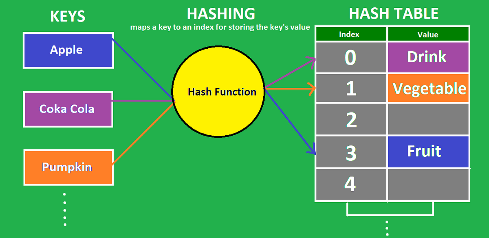
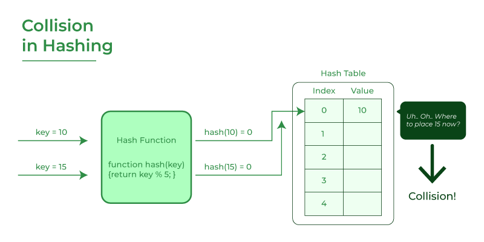

<style>h1,h2,h3,h4 { border-bottom: 0; } </style>
# <span style="color: white;">Hash Table Data Structure</span>

# Introduction

## 1 - What is Hashing

Hashing refers to the process of generating a fixed-size output from an input of variable size using the mathematical formulas known as hash functions. This technique determines an index or location for the storage of an item in a data structure.

## 2 - Components of Hashing

There are majorly three components of Hashing:
+ **Key**: A Key can be anything string or integer which is fed as input in the hash function the technique that determines an index or location for storage of an item in a data structure. 
+ **Hash Function**: The hash function receives the input key and returns the index of an element in an array called a hash table. The index is known as the hash index.
+ **Hash Table**: Hash table is a data structure that maps keys to values using a special function called a hash function. Hash stores the data in an associative manner in an array where each data value has its own unique index.


## 3 - Hash Table visualization



## 4 - what is Collesion

The hashing process generates a small number for a big key, so there is a possibility that two keys could produce the same value. The situation where the newly inserted key maps to an already occupied, and it must be handled using some collision handling technology.




# Hash Functions & Collesions Handling

## I - Hash Functions

### What is hash function

The hash function creates a mapping between key and value, this is done through the use of mathematical formulas known as hash functions. The result of the hash function is referred to as a hash value or hash. The hash value is a representation of the original string of characters but usually smaller than the original.

### Types of hash function

There are many hash functions that use numeric or alphanumeric keys. This article focuses on discussing different hash functions:
+ [Division Method](https://www.geeksforgeeks.org/hash-functions-and-list-types-of-hash-functions/#:~:text=1.%20Division%20Method,the%20remainder%20obtained.)
+ [Mid-Square Method](https://www.geeksforgeeks.org/introduction-to-hashing-data-structure-and-algorithm-tutorials/The%20mid%20square%20method%20is%20a%20very%20good%20hashing%20method.%20It%20involves%20two%20steps%20to%20compute%20the%20hash%20value-%20%20Square%20the%20value%20of%20the%20key%20k%20i.e.%20k2%20Extract%20the%20middle%20r%20digits%20as%20the%20hash%20value.)
+ [Folding Method](https://www.geeksforgeeks.org/hash-functions-and-list-types-of-hash-functions/#:~:text=3.%20Digit%20Folding,carry%20if%20any.)
+ [Multiplication Method](https://www.geeksforgeeks.org/hash-functions-and-list-types-of-hash-functions/)

### Properties of a Good hash function.

A good hash function should have the following properties:
+ Efficiently computable.  
+ Should uniformly distribute the keys (Each table position is equally likely for each.
+ Should minimize collisions.
+ Should have a low load factor(number of items in the table divided by the size of the table).

## II - Collesions Handling

There are mainly two methods to handle collision: 
+ [Separate Chaining (Open hashing)](https://www.geeksforgeeks.org/separate-chaining-collision-handling-technique-in-hashing/)
+ [Open Addressing (Closed hashing)](https://www.geeksforgeeks.org/open-addressing-collision-handling-technique-in-hashing/).


# Implementation

```js
/**
 * Hash Table Data Structure
 * 
 * hash function => i used division method
 * to avoid collisions => i used bucket which contains array of key-value 
 */
class HashTable {
    constructor(size) {
        this.table = new Array(size);
        this.size = size;
    }

    hashFunction(key) {
        let total = 0;
        if (typeof key === "number") {
            total = key;
        } else {
            for (let i = 0; i < key.length; i++) {
                total += key.charCodeAt(i);
            }
        }
        return total % this.size
    }

    set(key, value) {
        let index = this.hashFunction(key);

        let bucket = this.table[index];

        if (!bucket) {
            this.table[index] = [[key, value]];
        } else {
            let isThereSameKey = bucket.find(item => item[0] === key);

            if (isThereSameKey) {
                sameKeyIndex = bucket.findIndex(item => item[0] === key);
                bucket[sameKeyIndex] = [key, value];
            } else {
                bucket.push([key, value]);
            }
        }
    }

    get(key) {
        let index = this.hashFunction(key);

        let bucket = this.table[index];

        if (bucket) {
            let itemIndex = bucket.findIndex(item => item[0] === key);
            return bucket[itemIndex][1];
        } else {
            return -1
        }
    }

    remove(key) {
        let index = this.hashFunction(key);
        let bucket = this.table[index];
        if (bucket) {
            let itemIndex = bucket.findIndex(item => item[0] === key);
            bucket.splice(itemIndex, 1);
            return true
        }
        return false
    }

    print() {
        let hashTableData = [];
        for (let i = 0; i < this.table.length; i++) {
            if (this.table[i]) {
                hashTableData.push(this.table[i])
            }
        }
        return hashTableData
    }
}
```